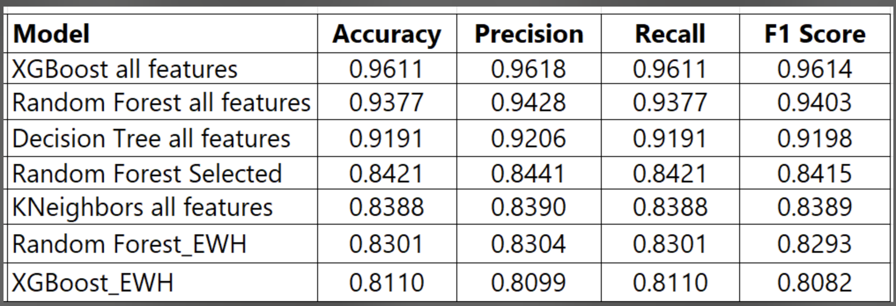

# Classification of Obesity Levels Based on Eating Habits and Physical Condition Using Data Analysis

## Project Overview

This project applies machine learning techniques to predict obesity levels based on various factors (such as age, gender, height, and weight) and lifestyle habits (e.g. eating patterns, exercise, smoking, and water intake).  To do so we analyze the dataset titled  ["Estimation of Obesity Levels Based on Eating Habits and Physical Condition” ](https://archive.ics.uci.edu/dataset/544/estimation+of+obesity+levels+based+on+eating+habits+and+physical+condition), and consider its
16 features, 1 target variable and 2111 observations.  

### Team members 
| Team Member | Video Links |
| ------------------|-------------|
| [**Arezoo Khalili**](https://github.com/Arezookhalili)| [Video link]() |
| [**Jyoti Narang**](https://github.com/drop2jyoti) | [Video Link]() |
| [**Kathryn Vozoris**](https://github.com/KathrynVozoris) | [Video Link]()|
|  [**Zekiye Erdem**](https://github.com/zekiyerdem)|[Video Link](https://drive.google.com/drive/folders/1edbiriTnRMPIYdsnzrAsmYj4fHGTJP6n?usp=sharing)|

## Potential Applications for Results

This project uses feature importance analysis to highlight the key factors influencing obesity.  The results found here could assist organizations in enhancing their decision-making processes. Below is a summary of such organizations and potential applications. 

####  Public Health Organizations: 
Given information on which features in the dataset are the greatest predictors of obesity levels, public health professionals could craft educational campaigns focusing on the most impactful aspects.  

####  Health Care Providers and Practitioners:  
The results could be used by health care professionals to monitor and manage obesity. More specifically they could be applied to help create a health recommendation system by leveraging the identified key variables related to lifestyle habits, dietary patterns, and physical conditions.  Such a system could aid in identifying at risk individuals who could then be offered interventions and support.  

####  Insurance Companies
The analysis could help in designing custom insurance policies or health premiums based on the identified obesity risks.

## Libraries and Frameworks

This project will be performed using Python and Python Libraries including: 
      <ul>
        <li>Pandas</li>
        <li>Numpy</li>
        <li>Matplotlib</li>
        <li>Scikit-Learn</li>
        <li>seaborn</li>
        <li>XGBoost</li>
        <li>SHAP</li>
      </ul>
For more details, please see the [requirement.txt](requirement.txt) file.

## Dataset Information
As this dataset is **synthetic** with all classes balanced, class imbalance is not an issue. **77% of the data** was generated synthetically using the **Weka tool** and the **SMOTE filter**, while **23% of the data** was collected directly from users through a web platform.

The dataset contains 16 features such as family history of being overweight and consumption patterns, which we analyze here to determine their impact on obesity levels.
Additionally, we consider how physical activity, modes of transportation, calorie monitoring and technology usage correlate with obesity across various age groups. 

The target variable, **Obesity Level**, represents obesity levels and includes **7 classes**, making this a **multi-class classification problem**. The classes are as follows:

- Class 0: Insufficient Weight
- Class 1: Normal Weight
- Class 2: Overweight Level I
- Class 3: Overweight Level II
- Class 4: Obesity Type I
- Class 5: Obesity Type II
- Class 6: Obesity Type III
  
For more information about the dataset columns names please visit [here](data/README.md).

## Methodology Outline

All notebooks created for the Obesity Estimation Classification can be found [here](notebooks)

### A.  [Exploratory Data Analysis](notebooks/Obesity_estimation_eda.ipynb)

#### 1. Data Exploration
- Examination of  **class distribution** and **age distribution**
- Identification of **outliers** and  **missing values**
- Examination of the effect of specific features on obesity, such as **eating habits** and **activity levels**
- Analysis of **correlations** between variables

#### 2. **Data Cleaning**  
Before modeling, we performed the following data cleaning steps:
- Removal of **duplicates**
- Handling of **outliers**
- Checking for**missing values**

#### 3. Visualizations and Observations
- Box plots, scatter plots, bar plots, histograms 
- Correlation analysis
- Conclusions and summary of findings

#### 4. Key Observations 
- We have highest number of people with Obesity_Type 1. [1](https://private-user-images.githubusercontent.com/178594683/393375811-95345797-f4d4-40a7-93c2-060ed4caa992.jpeg?jwt=eyJhbGciOiJIUzI1NiIsInR5cCI6IkpXVCJ9.eyJpc3MiOiJnaXRodWIuY29tIiwiYXVkIjoicmF3LmdpdGh1YnVzZXJjb250ZW50LmNvbSIsImtleSI6ImtleTUiLCJleHAiOjE3MzM1MjA1MTEsIm5iZiI6MTczMzUyMDIxMSwicGF0aCI6Ii8xNzg1OTQ2ODMvMzkzMzc1ODExLTk1MzQ1Nzk3LWY0ZDQtNDBhNy05M2MyLTA2MGVkNGNhYTk5Mi5qcGVnP1gtQW16LUFsZ29yaXRobT1BV1M0LUhNQUMtU0hBMjU2JlgtQW16LUNyZWRlbnRpYWw9QUtJQVZDT0RZTFNBNTNQUUs0WkElMkYyMDI0MTIwNiUyRnVzLWVhc3QtMSUyRnMzJTJGYXdzNF9yZXF1ZXN0JlgtQW16LURhdGU9MjAyNDEyMDZUMjEyMzMxWiZYLUFtei1FeHBpcmVzPTMwMCZYLUFtei1TaWduYXR1cmU9YTU4NTJiZDhkNTg0ZWY1NjY4OTdmYzMzZjhhMDk1ZmI0MjM5ZTY5MWZmNmZiNTE1YTE3Njg5MDlmZWVjODNiMSZYLUFtei1TaWduZWRIZWFkZXJzPWhvc3QifQ.8KAxp-NkAgPFfHLLhhcXa9abLDMs2OAELzfOslKG8No)
- On average most people have family history of obesity.[2](https://private-user-images.githubusercontent.com/178594683/393374898-066f6f36-e370-4bea-a00f-b7e754fc285e.jpeg?jwt=eyJhbGciOiJIUzI1NiIsInR5cCI6IkpXVCJ9.eyJpc3MiOiJnaXRodWIuY29tIiwiYXVkIjoicmF3LmdpdGh1YnVzZXJjb250ZW50LmNvbSIsImtleSI6ImtleTUiLCJleHAiOjE3MzM1MjA1MTEsIm5iZiI6MTczMzUyMDIxMSwicGF0aCI6Ii8xNzg1OTQ2ODMvMzkzMzc0ODk4LTA2NmY2ZjM2LWUzNzAtNGJlYS1hMDBmLWI3ZTc1NGZjMjg1ZS5qcGVnP1gtQW16LUFsZ29yaXRobT1BV1M0LUhNQUMtU0hBMjU2JlgtQW16LUNyZWRlbnRpYWw9QUtJQVZDT0RZTFNBNTNQUUs0WkElMkYyMDI0MTIwNiUyRnVzLWVhc3QtMSUyRnMzJTJGYXdzNF9yZXF1ZXN0JlgtQW16LURhdGU9MjAyNDEyMDZUMjEyMzMxWiZYLUFtei1FeHBpcmVzPTMwMCZYLUFtei1TaWduYXR1cmU9NDZkZWNjZjg4OWJjNGVhMGZjNDg1MmNjYTk1MmQ5NGJlNjU0N2NiNjRiZDE5YjA5NTczM2RhNDUyMGI0OGY1NSZYLUFtei1TaWduZWRIZWFkZXJzPWhvc3QifQ.lf2YD1hSruER2i_oIQGVKg3VkTL-N0WSrikUnf-jfEQ)
- Most people use some form of vehicles while only ~2.7% prefers walking/using bike That's concerning!
- More females are Obese as compared to males.[3](https://private-user-images.githubusercontent.com/178594683/393376313-e9d152ee-3248-41e1-a019-ee8cfab3822d.jpeg?jwt=eyJhbGciOiJIUzI1NiIsInR5cCI6IkpXVCJ9.eyJpc3MiOiJnaXRodWIuY29tIiwiYXVkIjoicmF3LmdpdGh1YnVzZXJjb250ZW50LmNvbSIsImtleSI6ImtleTUiLCJleHAiOjE3MzM1MjA1MTEsIm5iZiI6MTczMzUyMDIxMSwicGF0aCI6Ii8xNzg1OTQ2ODMvMzkzMzc2MzEzLWU5ZDE1MmVlLTMyNDgtNDFlMS1hMDE5LWVlOGNmYWIzODIyZC5qcGVnP1gtQW16LUFsZ29yaXRobT1BV1M0LUhNQUMtU0hBMjU2JlgtQW16LUNyZWRlbnRpYWw9QUtJQVZDT0RZTFNBNTNQUUs0WkElMkYyMDI0MTIwNiUyRnVzLWVhc3QtMSUyRnMzJTJGYXdzNF9yZXF1ZXN0JlgtQW16LURhdGU9MjAyNDEyMDZUMjEyMzMxWiZYLUFtei1FeHBpcmVzPTMwMCZYLUFtei1TaWduYXR1cmU9Yzk1MTFjNTgyYWFhMTdlNTk2OGJjOTM5ODNjZDFjODcxOGNmYWQ1Mzc3NzIwM2YwODkwOWM4OWRiMzllZjRiNCZYLUFtei1TaWduZWRIZWFkZXJzPWhvc3QifQ.FUR8BJ8fr3hVXyC-cf7sdQWwiQ7UL8CieqqoJl2DI88)
- We noticed a relatively strong positive correlation between 'Weight' and 'Height'.[4](https://private-user-images.githubusercontent.com/178594683/393376647-e26b4691-e670-4dbc-bbd0-990c732c6ad4.jpeg?jwt=eyJhbGciOiJIUzI1NiIsInR5cCI6IkpXVCJ9.eyJpc3MiOiJnaXRodWIuY29tIiwiYXVkIjoicmF3LmdpdGh1YnVzZXJjb250ZW50LmNvbSIsImtleSI6ImtleTUiLCJleHAiOjE3MzM1MjA1MTEsIm5iZiI6MTczMzUyMDIxMSwicGF0aCI6Ii8xNzg1OTQ2ODMvMzkzMzc2NjQ3LWUyNmI0NjkxLWU2NzAtNGRiYy1iYmQwLTk5MGM3MzJjNmFkNC5qcGVnP1gtQW16LUFsZ29yaXRobT1BV1M0LUhNQUMtU0hBMjU2JlgtQW16LUNyZWRlbnRpYWw9QUtJQVZDT0RZTFNBNTNQUUs0WkElMkYyMDI0MTIwNiUyRnVzLWVhc3QtMSUyRnMzJTJGYXdzNF9yZXF1ZXN0JlgtQW16LURhdGU9MjAyNDEyMDZUMjEyMzMxWiZYLUFtei1FeHBpcmVzPTMwMCZYLUFtei1TaWduYXR1cmU9NDI2ODQwNTY5ZmUxNGU5MjlmMGViOTA4ZDRmY2RmYTU3MzlkNTMwZGQ3ZTlkZjEzNWM4NjkyZDY3OTYyNjJkYiZYLUFtei1TaWduZWRIZWFkZXJzPWhvc3QifQ.m0D-BmIt14rcL2Ybp6lEJC0Yvqrju2MfoNwcxDLPMxQ)
- Outliers are present in 'Age'.[5](https://private-user-images.githubusercontent.com/178594683/393377281-8aecb4df-ee2c-4b4f-be22-dac1fa34ef0e.jpeg?jwt=eyJhbGciOiJIUzI1NiIsInR5cCI6IkpXVCJ9.eyJpc3MiOiJnaXRodWIuY29tIiwiYXVkIjoicmF3LmdpdGh1YnVzZXJjb250ZW50LmNvbSIsImtleSI6ImtleTUiLCJleHAiOjE3MzM1MjA1MTEsIm5iZiI6MTczMzUyMDIxMSwicGF0aCI6Ii8xNzg1OTQ2ODMvMzkzMzc3MjgxLThhZWNiNGRmLWVlMmMtNGI0Zi1iZTIyLWRhYzFmYTM0ZWYwZS5qcGVnP1gtQW16LUFsZ29yaXRobT1BV1M0LUhNQUMtU0hBMjU2JlgtQW16LUNyZWRlbnRpYWw9QUtJQVZDT0RZTFNBNTNQUUs0WkElMkYyMDI0MTIwNiUyRnVzLWVhc3QtMSUyRnMzJTJGYXdzNF9yZXF1ZXN0JlgtQW16LURhdGU9MjAyNDEyMDZUMjEyMzMxWiZYLUFtei1FeHBpcmVzPTMwMCZYLUFtei1TaWduYXR1cmU9ZDg2OWM2Mzk4OTRhN2E0NTM2NmQ2MGFjNzJkZjQwNWVmZDQ4N2NhNjg5NTY5NDkxMWJmZTE4NzYxZWIzYjBlZCZYLUFtei1TaWduZWRIZWFkZXJzPWhvc3QifQ.3_jjPbGd4i1gGVJ4T9SRxK4NxctyDD21PyKLNml48Ss)

### B. [Machine Learning Analysis](notebooks/Obesity_estimation_feature_eng_ML.ipynb)

#### 1. **Preprocessing** 
- Preparation of **categorical variables** for machine learning using **one-hot encoding**
- Scaling of numerical features using Standard Scaler
- Label encoding of target variable

#### 2. **Machine Learning Modeling**  
- Implementation of multiple classification algorithms:
- **Decision Tree**
- **Random Forest**
- **KNeighbors**
- **XGBoost**
- Evaluation of models using the metrics: **accuracy**, **precision**, **recall**, and **F1 score**
   
#### 3. Hyperparameter Tuning
- Tuning of hyperparameters on XGBoost and Random Forest models
- Comparison of model performances to select the best-performing model using **GridSearch**
- Application of  **5-fold cross-validation**

#### 4. **Feature Engineering**
- **XGBoost, Random Forest** and **SHAP** to assess **feature importance**
- Utilization of **correlation matrix** insight to eliminate redundant features

#### 5. **Feature Elimination and Model Comparison** 
- Reduction of the feature set based on **feature importance** and **correlations**
- Comparison of performance of the models with a reduced feature set against the baseline model

#### 6. **Findings and Conclusion**  
- Summarization of key findings from the **EDA** and **ML analysis**
- Determine the influence of various features in predicting obesity levels
- Recommendations for future research

### Key Observations

XGBoost was the highest performing model with 96.1% accuracy and Random Forest performing slightly behind it with 93.7% accuracy. Eliminating 'Height' and 'Weight' from the features to reduce bias (as these are used to calculate BMI, which is one measure of obesity) we saw only a slight drop in performance. This demonstrates the strength of the models in predicting obesity levels from the other features. A reduced feature set can be a viable option for faster inference and simpler deployment without substantial loss of accuracy.

The results from the **SHAP** [6](https://private-user-images.githubusercontent.com/178594683/393377954-c29f0b8e-7034-4f8c-b3c8-c8c009833ae6.jpeg?jwt=eyJhbGciOiJIUzI1NiIsInR5cCI6IkpXVCJ9.eyJpc3MiOiJnaXRodWIuY29tIiwiYXVkIjoicmF3LmdpdGh1YnVzZXJjb250ZW50LmNvbSIsImtleSI6ImtleTUiLCJleHAiOjE3MzM1MjA1MTEsIm5iZiI6MTczMzUyMDIxMSwicGF0aCI6Ii8xNzg1OTQ2ODMvMzkzMzc3OTU0LWMyOWYwYjhlLTcwMzQtNGY4Yy1iM2M4LWM4YzAwOTgzM2FlNi5qcGVnP1gtQW16LUFsZ29yaXRobT1BV1M0LUhNQUMtU0hBMjU2JlgtQW16LUNyZWRlbnRpYWw9QUtJQVZDT0RZTFNBNTNQUUs0WkElMkYyMDI0MTIwNiUyRnVzLWVhc3QtMSUyRnMzJTJGYXdzNF9yZXF1ZXN0JlgtQW16LURhdGU9MjAyNDEyMDZUMjEyMzMxWiZYLUFtei1FeHBpcmVzPTMwMCZYLUFtei1TaWduYXR1cmU9Y2IwOWRjNDAwYjNiMmMxZGY3M2JmZGIyZGZhZTMwZDM3OGUxYWY3OGJhNjk4NDQ1ZTQ5MDRjNGFiMGZmZjZiZiZYLUFtei1TaWduZWRIZWFkZXJzPWhvc3QifQ.9gUxkjJ54WPACq3ifJwS39Acl46L-eZM76MDEFzRefc) run on models excluding 'Height' and 'Weight' showed the following features to be the top predictors of obesity levels:

- Age
- Frequency of Vegetables (Freq_Veg)
- Gender
- Water Intake
- Physical Activity
- Tech Use
- Number of Meals (Num_Meals)
 - Family History of Obesity (Yes)

For higher levels of obesity (Obesity levels I, II, and III) the following features are the main indicators in predicting obesity:

- Gender
- Age
- Water Intake
- Tech Use

Therefore, these are the features of primary importance when assessing an individual's risk of obesity. The features could be considered by institutions and public health departments looking to reduce obesity levels across populations.

### Results

The table below shows the performance results of the various models tested. Models run with the features 'Height' and 'Weight' eliminated are noted as '_EWH'.  Models run with 'Selected Features' were run using only the top 8 features indicated above: Age, Frequency of Vegetables, Gender, Water Intake, Physical Activity, Tech Use, Number of Meals and Family History (Yes).

 
### Future Scope and Next Steps

XGBoost is the most robust and reliable model for this dataset. It should be considered as the primary model for deployment or further analysis. Future experiments could include fine-tuning XGBoost hyperparameters and evaluating its performance on unseen test data or under real-world conditions. The models tested here performed best when run on all features. The features of highest importance were `Weight`, `Height`, `Age`, and `Freq_Veg`. Hence, in future model applications we recommend the inclusion of these key features, except in cases of computational or data collection constraints.  

Lastly, we considered miscategorized data using a Confusion Matrix[7](https://private-user-images.githubusercontent.com/178594683/393378203-3c33943f-fd14-4586-a9a1-6a2d48c4df23.jpeg?jwt=eyJhbGciOiJIUzI1NiIsInR5cCI6IkpXVCJ9.eyJpc3MiOiJnaXRodWIuY29tIiwiYXVkIjoicmF3LmdpdGh1YnVzZXJjb250ZW50LmNvbSIsImtleSI6ImtleTUiLCJleHAiOjE3MzM1MjA1MTEsIm5iZiI6MTczMzUyMDIxMSwicGF0aCI6Ii8xNzg1OTQ2ODMvMzkzMzc4MjAzLTNjMzM5NDNmLWZkMTQtNDU4Ni1hOWExLTZhMmQ0OGM0ZGYyMy5qcGVnP1gtQW16LUFsZ29yaXRobT1BV1M0LUhNQUMtU0hBMjU2JlgtQW16LUNyZWRlbnRpYWw9QUtJQVZDT0RZTFNBNTNQUUs0WkElMkYyMDI0MTIwNiUyRnVzLWVhc3QtMSUyRnMzJTJGYXdzNF9yZXF1ZXN0JlgtQW16LURhdGU9MjAyNDEyMDZUMjEyMzMxWiZYLUFtei1FeHBpcmVzPTMwMCZYLUFtei1TaWduYXR1cmU9MWJlNDUyOWYwMTVhNTQxNDY3Nzg3Yjg0NzExN2YzNTk4ZTM3OGIzNjBmMmIwNjc3MDAxYTFiODczMGUzZTIxNyZYLUFtei1TaWduZWRIZWFkZXJzPWhvc3QifQ.m464zxtodUyadclVp4WTnAvOofSx1v7P4YuzL1ktWhk).  These misclassified labels could also be the subject of further investigation.

#### Task Allocation

#### 1. **Exploratory Data Analysis (EDA)**
   - **Lead:** Jyoti
   - **Support:** Arezoo
   - Tasks: Examine class and age distributions, identify outliers, explore missing values, and analyze correlations.

#### 2. **Data Cleaning**
   - **Lead:** Arezoo
   - **Support:** Zekiye
   - Tasks: Remove duplicates, handle outliers, and manage missing values as necessary.

#### 3. **One-Hot Encoding for Categorical Variables and Scaling of Numerical Data**
   - **Lead:** Kathryn
   - Tasks: Prepare categorical variables for machine learning through one-hot encoding. Consider scaling options for numerical data, and apply scaler.

#### 4. **Machine Learning Modeling**
   - **Lead:** Zekiye
   - **Support:** Jyoti
   - Tasks: Implement Decision Tree, Random Forest, Logistic Regression, and Naive Bayes models. Evaluate and compare models on metrics (accuracy, precision, recall, F1 score, log loss).

#### 5. **Feature Engineering**
   - **Lead:** Zekiye
   - **Support:** Arezoo
   - Tasks: Use Random Forest for feature importance assessment and analyze correlation matrix to remove redundant features.

#### 6. **Feature Elimination and Model Comparison**
   - **Lead:** Jyoti
   - **Support:** Kathryn
   - Tasks: Perform feature elimination and compare model performance with a reduced feature set vs. the baseline model.

#### 7. **Findings and Conclusion**
   - **Lead:** Kathryn
   - **Support:** All Members
   - Tasks: Summarize key findings, draw conclusions, and compile the final report.

### Project 
https://github.com/users/drop2jyoti/projects/2

[See Images indexed here](https://github.com/drop2jyoti/Estimation-of-Obesity-Levels/blob/EDA_Kathryn/reports/Images.md)
