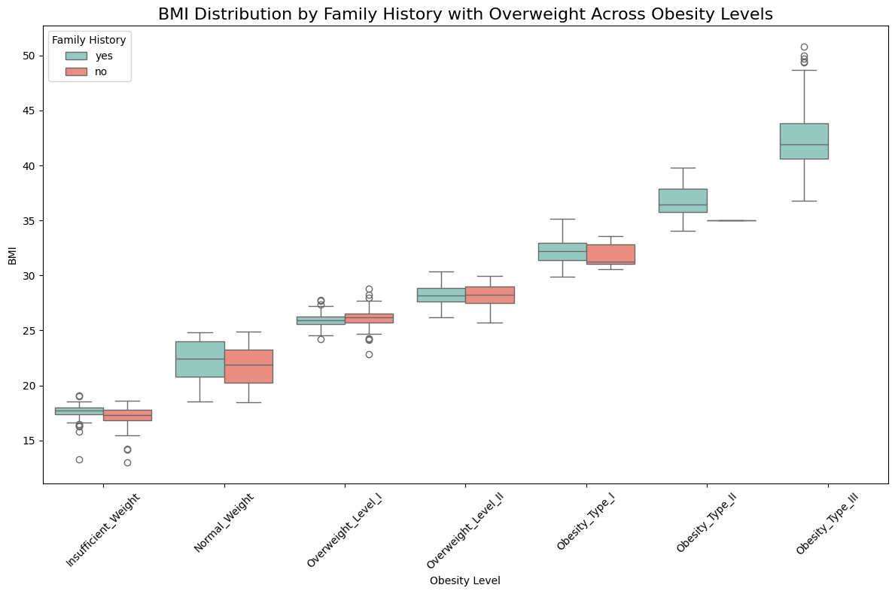
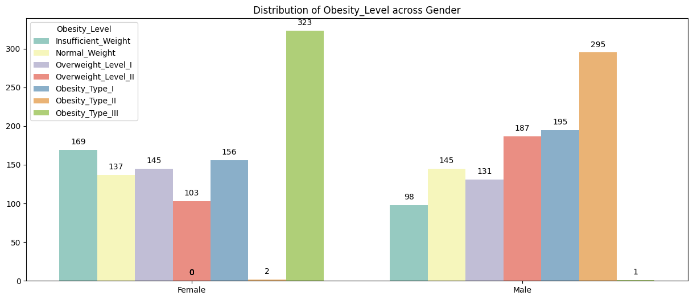
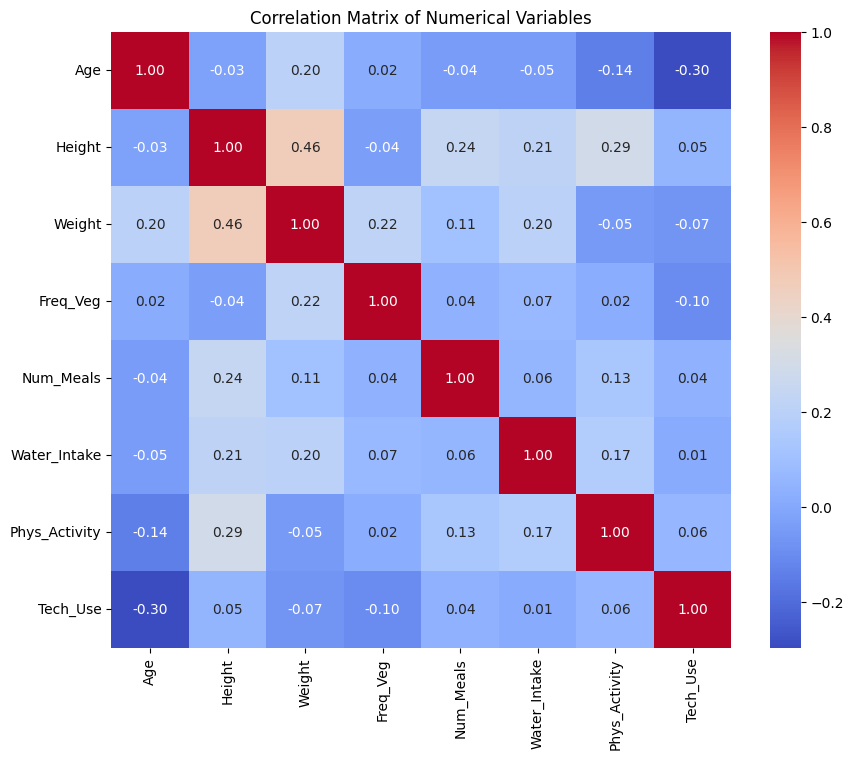
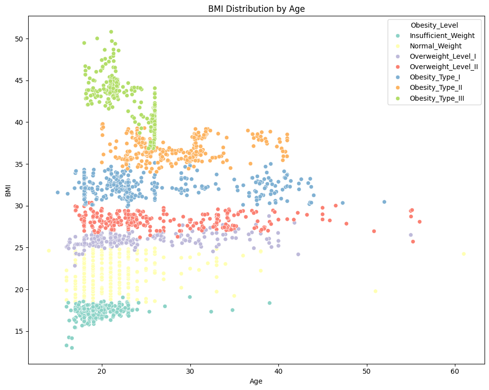
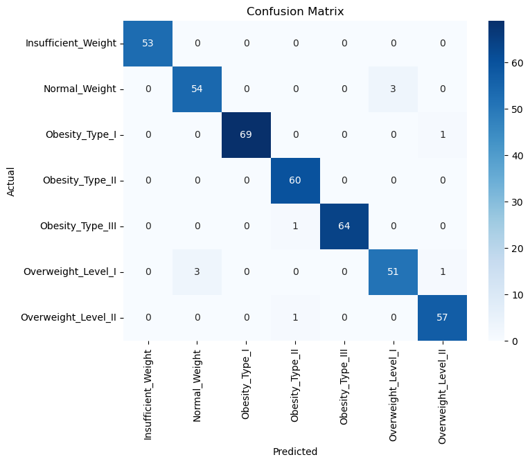

1. On average most people have family history of obesity.

2. More female are Obese as compared to male.

3. We noticed a relatively strong positive correlation between the Weight and Height.)

4. Outliers are present in Age.

5. SHAP

6. Lastly, we considered miscategorized data using a **Confusion Matrix**
