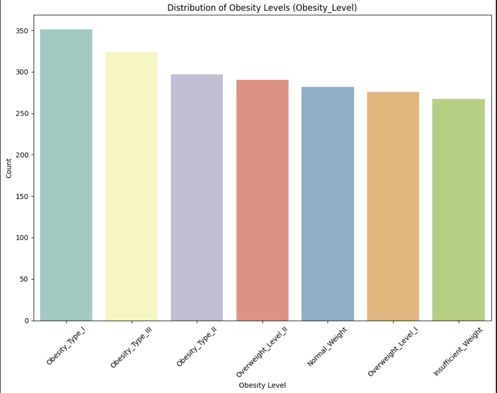
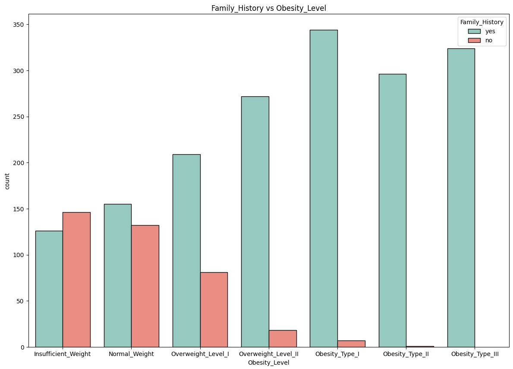
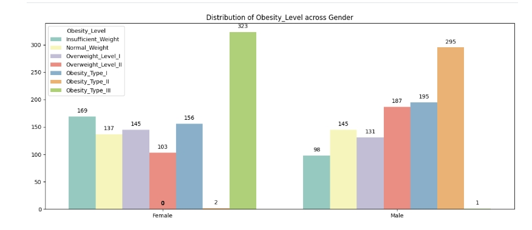
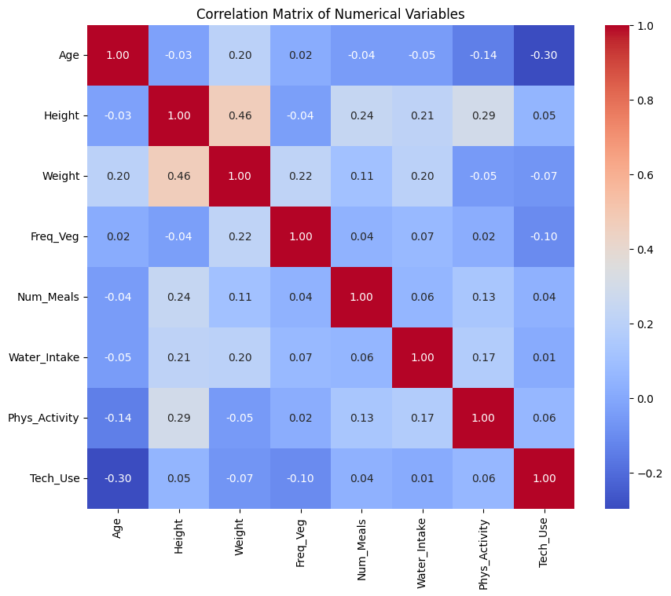
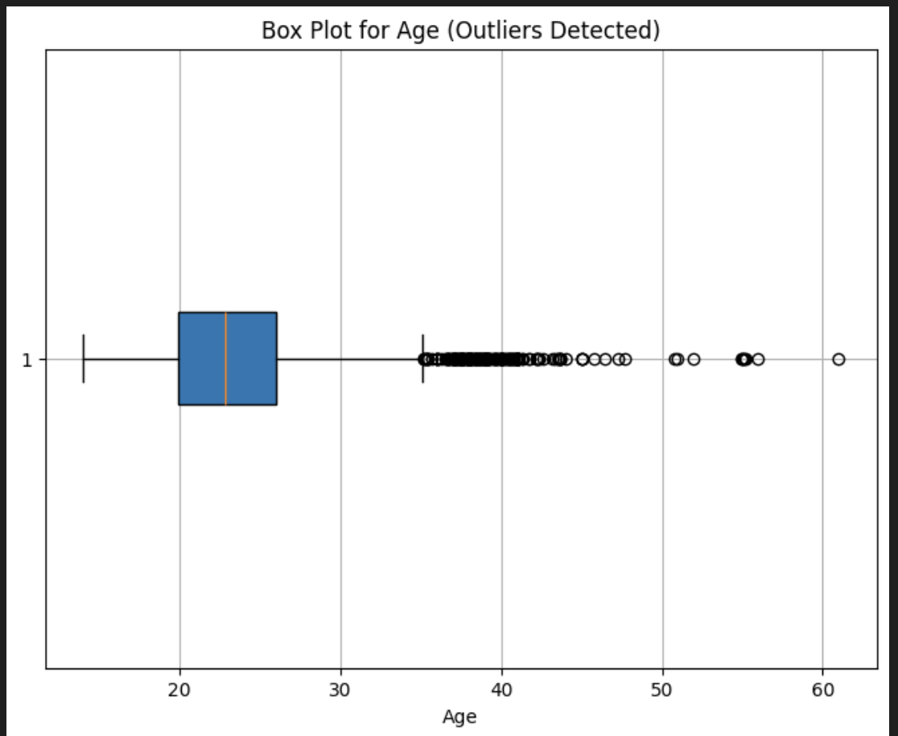
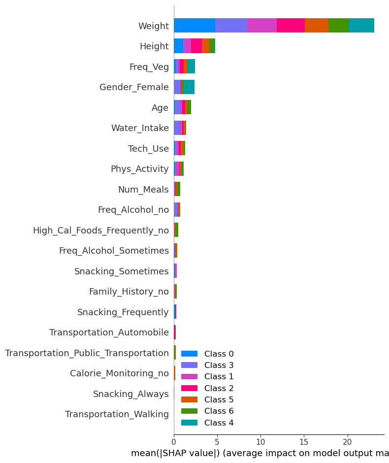
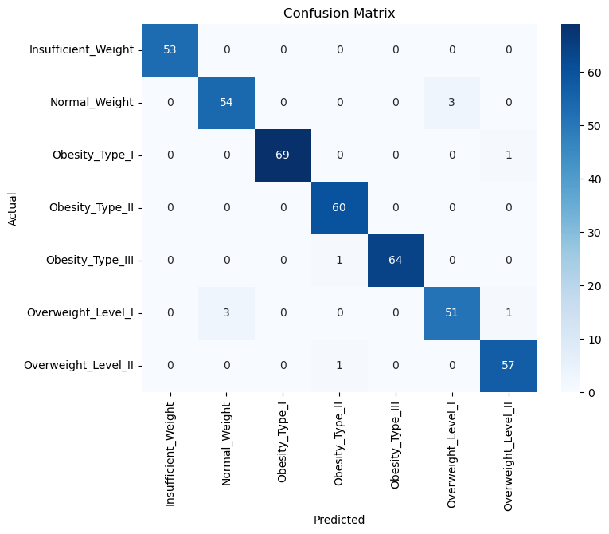

## 1. Most people are categorized as Obesity_Type_I
#

## 2. On average most people have family history of obesity.
#

## 3. More female are obese as compared to male.
#

## 4. We noticed a relatively strong positive correlation between 'Weight' and 'Height'.
#

## 5. Outliers are present in Age.
#

## 6. SHAP Analysis for XGBoost model run without the features 'Height' and 'Weight"
#
#

#
## 7. Lastly, we considered miscategorized data using a **Confusion Matrix**
#

